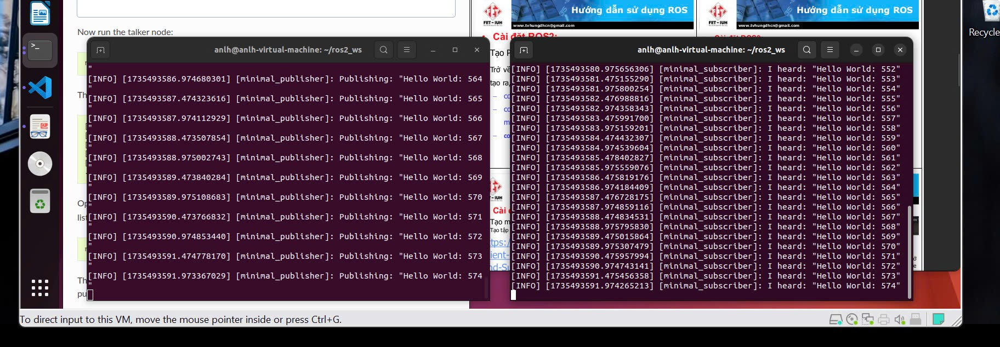

# `Advance Engineering Project`


## `ROS Tutorials:`
| `ROS Releases` | `Link` |
| -------------- | ------ |
| `18.0x(eloquent)` | https://docs.ros.org/en/eloquent/Installation/Linux-Install-Debians.html#resources |
| `20.0x(foxy)` | https://docs.ros.org/en/foxy/Installation/Ubuntu-Install-Debians.html#resources |
| `22.0x(humble)` | https://docs.ros.org/en/humble/Installation/Ubuntu-Install-Debs.html#resources |


## `Setup ROS 2 Environment:` for 22.0x(humble)

1. **Set locale**
   
    Make sure you have a locale which supports `UTF-8`.

    ``` bash
    locale # check for UTF-8
    sudo apt update && sudo apt install locales
    sudo locale-gen en_US en_US.UTF-8
    sudo update-locale LC_ALL=en_US.UTF-8 LANG=en_US.UTF-8 export LANG=en_US.UTF-8

    locale # verify setting
    ```

2. **Setup sources**

    You will need to add the ROS 2 apt repository to your system.

    First ensure that the [Ubuntu Universe repository][Ubuntu] is enabled.

    ``` bash
    sudo apt install software-properties-common
    sudo add-apt-repository universe
    ```

    Now add the ROS 2 GPG key with apt.

    ``` bash
    sudo apt update && sudo apt install curl -y
    sudo curl -sSL https://raw.githubusercontent.com/ros/rosdistro/master/ros.key -o /usr/share/keyrings/ros-archive-keyring.gpg
    ```

    Then add the repository to your sources list.

    ``` bash
    echo "deb [arch=$(dpkg --print-architecture) signed-by=/usr/share/keyrings/ros-archive-keyring.gpg] http://packages.ros.org/ros2/ubuntu $(. /etc/os-release && echo $UBUNTU_CODENAME) main" | sudo tee /etc/apt/sources.list.d/ros2.list > /dev/null
    ```


3. **Install ROS 2 packages**

    Update your apt repository caches after setting up the repositories.

    ``` bash
    sudo apt update
    ```

    ROS 2 packages are built on frequently updated Ubuntu systems. It is always recommended that you ensure your system is up to date before installing new packages.

    ``` bash
    sudo apt upgrade
    ```

    Desktop Install (`Recommended`): ROS, RViz, demos, tutorials.

    ``` bash
    sudo apt install ros-humble-desktop
    ```

    Development tools: Compilers and other tools to build ROS packages

    ``` bash
    sudo apt install ros-dev-tools
    ```

4. **Environment setup**

    Set up your environment by sourcing the following file.

    ``` bash
    # Replace ".bash" with your shell if you're not using bash
    # Possible values are: setup.bash, setup.sh, setup.zsh
    source /opt/ros/humble/setup.bash
    ```


## `Using colcon to build:` for 22.0x(humble)

1. **Install colcon**

| Operating System | Command |
| ---------------- | ------- |
| `Linux` | sudo apt install python3-colcon-common-extensions |


## `Create a workspace:` for 22.0x(humble)
| Operating System | Command                                                                |
|------------------|------------------------------------------------------------------------|
| Linux            | `mkdir -p ~/ros2_ws/src`<br>`cd ~/ros2_ws/`                            |


## `Create a package:` for 22.0x(humble)
1. **Create a new package in your workspace.**
    
    Let’s use the workspace you created in the previous tutorial, `ros2_ws`, for your new package.
    Make sure you are in the `src` folder before running the package creation command.
    | Operating System | Command            |
    |------------------|--------------------|
    | Linux            | `cd ~/ros2_ws/src` |


    Callback source file setup.bash
    ``` bash
    source /opt/ros/humble/setup.bash
    ```

    The command syntax for creating a new package in ROS 2 is:
    `Python:` ros2 pkg create --build-type ament_python --license Apache-2.0 <package_name>
    e.g. `Python:` ros2 pkg create --build-type ament_python --license Apache-2.0 my_py_pkg

2. **Build a package**

    Return to the root of your workspace
    | Operating System | Command            |
    |------------------|--------------------|
    | Linux            | `cd ~/ros2_ws/`    |

    Now let's build the packages for the workspace.
    | Operating System | Command            |
    |------------------|--------------------|
    | Linux            | `colcon build`     |

    Or, to build only the `my_py_pkg` package next time, can run:
    ``` bash
    colcon build --packages-select my_py_pkg
    ```

3. **Source the setup file**

    To use your new package and executable, first open a new terminal and source your main ROS 2 installation.
    Then, from inside the `ros2_ws` directory, run the following command to source your workspace:
    | Operating System | Command            |
    |------------------|--------------------|
    | Linux            | `source install/local_setup.bash` |


## `Create a Node:` for 22.0x(humble)
Create and run a publisher and subscriber node using Python.

1. ** Open package directory**
    
    Open a new terminal and `source your ROS 2 installation` so that ros2 commands will work. 
    
    Navigate into the `ros2_ws` directory created in a previous tutorial.
    
    Recall that packages should be created in the `src` **directory**, not the root of the workspace. So, navigate into `ros2_ws/src`, and run the package creation command:
    ``` bash
    ros2 pkg create --build-type ament_python --license Apache-2.0 my_py_pkg
    ```
2. **Write the publisher node**
   
    Navigate into `ros2_ws/src/my_py_pkg/my_py_pkg`. Recall that this directory is a Python package with the same name as the ROS 2 package it’s nested in.

    | Operating System | Command            |
    |------------------|--------------------|
    | Linux            | `wget https://raw.githubusercontent.com/ros2/examples/humble/rclpy/topics/minimal_publisher/examples_rclpy_minimal_publisher/publisher_member_function.py` |

    Now there will be a new file named `publisher_member_function.py` adjacent to __init__.py.

    1. **Download the publisher node file**
        
        Open the file using your preferred text editor.
        ``` python
        import rclpy
        from rclpy.node import Node

        from std_msgs.msg import String


        class MinimalPublisher(Node):

            def __init__(self):
                super().__init__('minimal_publisher')
                self.publisher_ = self.create_publisher(String, 'topic', 10)
                timer_period = 0.5  # seconds
                self.timer = self.create_timer(timer_period, self.timer_callback)
                self.i = 0

            def timer_callback(self):
                msg = String()
                msg.data = 'Hello World: %d' % self.i
                self.publisher_.publish(msg)
                self.get_logger().info('Publishing: "%s"' % msg.data)
                self.i += 1


        def main(args=None):
            rclpy.init(args=args)

            minimal_publisher = MinimalPublisher()

            rclpy.spin(minimal_publisher)

            # Destroy the node explicitly
            # (optional - otherwise it will be done automatically
            # when the garbage collector destroys the node object)
            minimal_publisher.destroy_node()
            rclpy.shutdown()


        if __name__ == '__main__':
            main()
        ```
    2. **Add an entry point**
        
        Open the `setup.py` file. Again, match the `maintainer`, `maintainer_email`, `description` and `license` fields to your `package.xml`:
        ``` bash
        maintainer='YourName',
        maintainer_email='you@email.com',
        description='Examples of minimal publisher/subscriber using rclpy',
        license='Apache License 2.0',
        ```

        Add the following line within the `console_scripts` brackets of the `entry_points` field:
        ``` bash
        entry_points={
            'console_scripts': [
                    'talker = my_py_pkg.publisher_member_function:main',
            ],
        },
        ```

3. **Write the subscriber node**
    
    Return to `ros2_ws/src/my_py_pkg/my_py_pkg` to create the next node. Enter the following code in your terminal:

    | Operating System | Command            |
    |------------------|--------------------|
    | Linux            | `wget https://raw.githubusercontent.com/ros2/examples/humble/rclpy/topics/minimal_subscriber/examples_rclpy_minimal_subscriber/subscriber_member_function.py` |

    Now the directory should have these files:
    ``` bash
    __init__.py  publisher_member_function.py  subscriber_member_function.py
    ```
    1. **Download the subscriber node file**
        
        Open the `subscriber_member_function.py` with your text editor.
        ``` python
        import rclpy
        from rclpy.node import Node

        from std_msgs.msg import String


        class MinimalSubscriber(Node):

            def __init__(self):
                super().__init__('minimal_subscriber')
                self.subscription = self.create_subscription(
                    String,
                    'topic',
                    self.listener_callback,
                    10)
                self.subscription  # prevent unused variable warning

            def listener_callback(self, msg):
                self.get_logger().info('I heard: "%s"' % msg.data)


        def main(args=None):
            rclpy.init(args=args)

            minimal_subscriber = MinimalSubscriber()

            rclpy.spin(minimal_subscriber)

            # Destroy the node explicitly
            # (optional - otherwise it will be done automatically
            # when the garbage collector destroys the node object)
            minimal_subscriber.destroy_node()
            rclpy.shutdown()


        if __name__ == '__main__':
            main()
        ```
    2. **Add an entry point**
        
        Reopen `setup.py` and add the entry point for the subscriber node below the publisher’s entry point. The `entry_points` field should now look like this:
        ``` bash
        entry_points={
        'console_scripts': [
                'talker = my_py_pkg.publisher_member_function:main',
                'listener = my_py_pkg.subscriber_member_function:main',
            ],
        },
        ```

4. **Build and run**

    You likely already have the `rclpy` and `std_msgs` packages installed as part of your ROS 2 system. It’s good practice to run `rosdep` in the root of your workspace (`ros2_ws`) to check for missing dependencies before building:

    | Operating System | Command            |
    |------------------|--------------------|
    | Linux            | `rosdep install -i --from-path src --rosdistro humble -y` |

    Still in the root of your workspace, ros2_ws, build your new package:

    | Operating System | Command            |
    |------------------|--------------------|
    | Linux            | `colcon build --packages-select my_py_pkg` |

    Open a new terminal, navigate to `ros2_ws`, and source the setup files:

    | Operating System | Command            |
    |------------------|--------------------|
    | Linux            | `source install/setup.bash` |

    Now run the talker node:
    ``` bash
    ros2 run my_py_pkg talker
    ```    


## `Result:`



## `Launch file:` for 22.0x(humble)
1. **Setup**
    Create a new directory to store your launch files:
    ``` bash
    mkdir launch
    ```

2. **Write the launch file**
    
    Let’s put together a ROS 2 launch file using the turtlesim package and its executables. As mentioned above, this can either be in Python, XML, or YAML.

    Copy and paste the complete code into the `launch/turtlesim_mimic_launch.py` file:
    ``` python
    from launch import LaunchDescription
    from launch_ros.actions import Node

    def generate_launch_description():
        return LaunchDescription([
            Node(
                package='turtlesim',
                namespace='turtlesim1',
                executable='turtlesim_node',
                name='sim'
            ),
            Node(
                package='turtlesim',
                namespace='turtlesim1',
                executable='turtlesim_node',
                name='sim'
            )
        ])
    ```

    `!` `Value_of_Namespace need to same for both nodes.`

3. **ros2 launch**
   To run the launch file created above, enter into the directory you created earlier and run the following command:

    ``` bash
    cd launch
    ros2 launch turtlesim_mimic_launch.py
    ```

[Ubuntu]: https://help.ubuntu.com/community/Repositories/Ubuntu